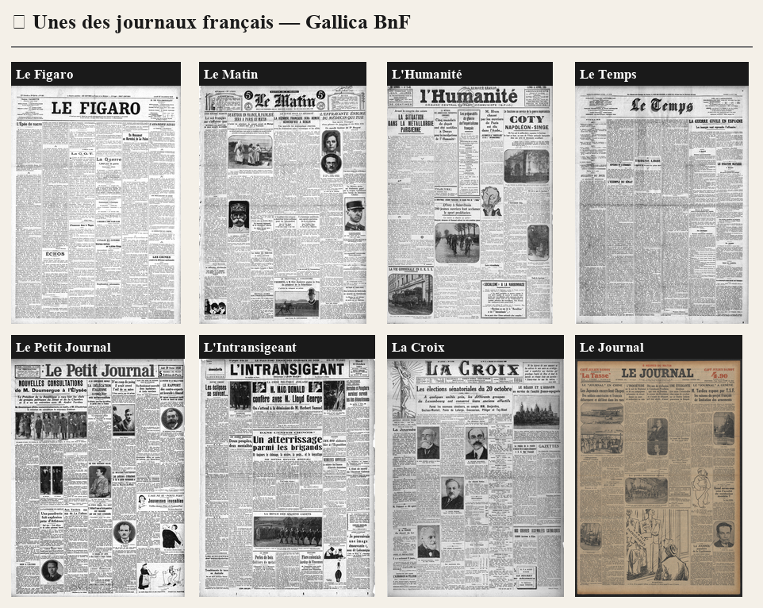
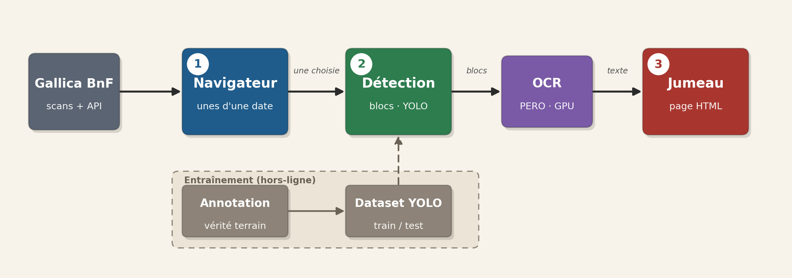
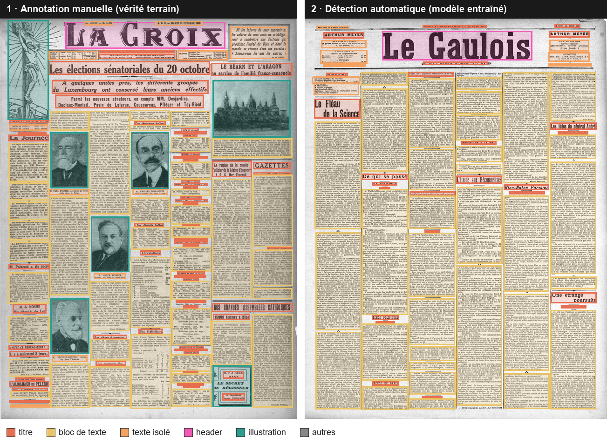
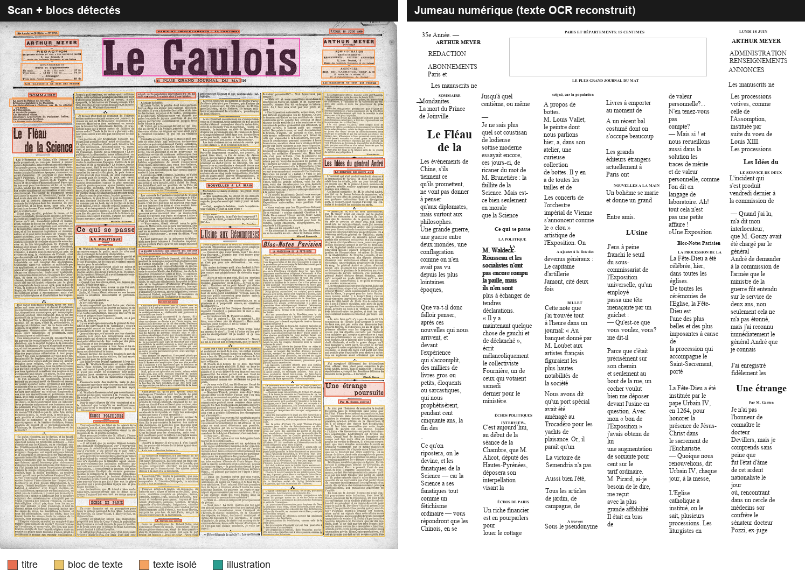

# 📰 Old Times Papers

**Explorer, détecter et « ressusciter » les unes de la presse française historique
numérisée par Gallica (BnF), de ~1850 à 1955.**

On choisit une date, on parcourt les unes des grands quotidiens de l'époque, et pour
n'importe quelle une on peut lancer une chaîne complète qui **détecte la structure de
la page** (titres, blocs de texte, illustrations…) puis **la reconstruit en un « jumeau
numérique »** : une page HTML navigable qui rejoue la mise en page d'origine avec le
texte OCRisé aux mêmes emplacements.



---

## Ce que contient le projet

Le dépôt réunit **trois composants** qui forment une chaîne de bout en bout, mais
restent utilisables indépendamment :

| # | Composant | Rôle | Dossier |
|---|-----------|------|---------|
| ① | **Navigateur d'unes** | Serveur local qui interroge Gallica et affiche les unes d'une date donnée | [`app/`](app) |
| ② | **Détection de blocs** | Outil d'annotation + entraînement d'un détecteur (YOLO) de la structure des pages | [`block-detection/`](block-detection) |
| ③ | **Jumeau numérique** | Pipeline détection → OCR → reconstruction HTML, + le banc d'essai des moteurs OCR | [`digital-twin/`](digital-twin) |



---

## ① Navigateur d'unes — `app/`

Un petit serveur Python (stdlib uniquement) qui sert une page web et **proxifie
l'API de Gallica** pour contourner CORS. Sur une date entre 1850 et 1955, il résout et
affiche les unes des ~60 titres du catalogue, avec une timeline pour passer d'une année
à l'autre en gardant le même jour/mois.

Fonctionnement d'une résolution :

1. Le JS appelle `/api/resolve?ark=cb…&date=YYYY-MM-DD`.
2. Le serveur suit la redirection Gallica
   `…/ark:/12148/{catalogue}/date{YYYYMMDD}` → ARK du fascicule (`bpt6k…`).
3. La vignette est chargée via IIIF :
   `…/iiif/ark:/12148/{bpt6k…}/f1/full/400,/0/native.jpg`.

Le serveur intègre un **cache mémoire**, un **token bucket** et un **circuit breaker**
qui se déclenche si Gallica bannit temporairement l'IP (erreurs SSL en série).

```powershell
conda activate oldspapers
python app/gallica_server.py --verbose      # ouvre http://localhost:8765
```

---

## ② Détection de blocs — `block-detection/`

Pour reconstruire une une, il faut d'abord en connaître la **structure**. Ce composant
entraîne un détecteur d'objets (YOLO) sur des unes annotées à la main. Le modèle détecte
5 classes : `header`, `titre`, `bloc de texte`, `texte isolé`, `illustration` (la classe
`autres`, marginale, est exclue à l'export du dataset).



*Le Matin, 16 juin 1925 — une **une de test** (jamais vue à l'entraînement). À gauche la
vérité terrain (111 blocs annotés), à droite la prédiction du modèle (116 blocs) : les
deux mises en page se superposent presque parfaitement.*

**Performances** du détecteur (YOLO11s, `conf=0.30`, `imgsz=1280`) mesurées sur le jeu
de test (11 unes held-out, 724 blocs) :

> 🎯 **Accuracy de classification : 94,6 %** — un bloc bien localisé reçoit la bonne classe
> 19 fois sur 20.
> 📐 **IoU moyen des boîtes : 0,89** — les cadres épousent de près les blocs réels
> (90 % ont un IoU ≥ 0,75).

| Métrique | Global | header | titre | bloc de texte | illustration | texte isolé |
|----------|:------:|:------:|:-----:|:-------------:|:------------:|:-----------:|
| **Accuracy** (classe) | **0,95** | 0,91 | 0,96 | 0,98 | 1,00 | 0,81 |
| **IoU moyen** (localisation) | **0,89** | 0,91 | 0,85 | 0,95 | 0,93 | 0,85 |
| Précision | 0,84 | 1,00 | 0,85 | 0,94 | 0,79 | 0,64 |
| Rappel | 0,87 | 0,99 | 0,86 | 0,93 | 0,94 | 0,61 |
| mAP@50 | 0,87 | 0,99 | 0,92 | 0,97 | 0,87 | 0,62 |
| mAP@50-95 | 0,71 | 0,83 | 0,65 | 0,89 | 0,75 | 0,41 |

Les classes structurantes (`header`, `bloc de texte`, `titre`) sont très bien détectées et
très bien localisées ; le `texte isolé` (légendes, entrefilets courts) reste le plus difficile.

- [`annotation/`](block-detection/annotation) — serveur web d'annotation (Flask + SQLite),
  téléchargeur d'unes depuis Gallica, aide à l'annotation (pré-OCR Tesseract, suggestions).
- [`training/`](block-detection/training) — export du dataset au format YOLO, entraînement,
  inférence, et génération de propositions de correction du jeu annoté.

```powershell
conda activate bloc_detection
python block-detection/annotation/server.py     # outil d'annotation
python block-detection/training/train.py        # entraînement YOLO (GPU)
```

---

## ③ Jumeau numérique — `digital-twin/`

Le cœur du projet : une pipeline qui transforme le scan d'une une en une **page
reconstruite**, bloc par bloc.



*En haut : à gauche le scan et ses blocs détectés, à droite le « jumeau » (texte OCR
replacé aux mêmes positions, titres centrés, blocs justifiés). En bas, le panneau de
contrôle : au clic sur un bloc (ici le bloc 21), son image lisible et sa transcription
OCR s'affichent côte à côte pour vérification.*

La chaîne (`run.py`) enchaîne trois étapes, chacune dans son environnement :

1. **`detect.py`** — YOLO détecte les blocs et leurs classes → `blocks.json`.
2. **`ocr.py`** — **PERO-OCR** (modèle presse européenne, sur GPU) OCRise chaque bloc de
   texte. Politique figée après benchmark : PERO partout (corps, titres, texte isolé),
   avec repli Tesseract si un bloc revient vide ; `header` → nom du journal (pas d'OCR) ;
   `illustration` → ignoré. Un post-traitement **dé-césure** recolle les mots coupés en
   fin de ligne (`auto-\nrité` → `autorité`, −5 % de WER).
3. **`build.py`** — construit le `twin.html` : scan + blocs à gauche, page reconstruite à
   droite, et au clic sur un bloc, son image et sa transcription côte à côte en bas.

```powershell
python digital-twin/run.py le_temps_1936-08-08 --open
```

Le sous-dossier [`benchmark/`](digital-twin/benchmark) contient le **grand comparatif**
des moteurs OCR (PERO, Kraken, doctr, Tesseract, Calamari…) × configurations × post-
traitements, avec ses métriques (CER / WER). C'est lui qui a désigné PERO-OCR comme
moteur retenu (~4 % WER, ~0,9 % CER).

---

## Tests

Chaque composant a une suite de tests unitaires **hermétiques** (aucun accès réseau,
GPU, modèle ou subprocess réel — les frontières I/O sont simulées, l'état global est
réinitialisé entre tests). Les tests d'intégration lourds sont derrière le marqueur
`integration`, exclu par défaut.

```powershell
conda activate oldspapers
python -m pytest block-detection        # 124 tests
python -m pytest digital-twin           #  37 tests
python -m pytest app                    #  34 tests
```

**195 tests** au total, tous verts sur un clone frais.

---

## Installation

Le projet utilise plusieurs environnements conda (les moteurs OCR ont des dépendances
incompatibles entre elles). Le plus courant, `oldspapers`, suffit pour le navigateur et
les tests :

```powershell
conda env create -f environment.yml     # crée l'env `oldspapers` (Python 3.12)
conda activate oldspapers
```

`curl` (livré avec Windows 10+) est utilisé comme backend HTTP vers Gallica ; `requests`
sert de repli. Les composants détection/OCR utilisent leurs propres envs (`bloc_detection`,
`pero`, …) — voir la doc de chaque dossier.

## Structure du dépôt

```
Old-Times-Papers/
├── app/                    # ① navigateur d'unes (serveur local Gallica)
│   ├── gallica_server.py
│   └── tests/
├── block-detection/        # ② détection de la structure des pages
│   ├── annotation/         #    outil d'annotation (Flask + SQLite)
│   └── training/           #    export dataset + entraînement YOLO
├── digital-twin/           # ③ pipeline détection → OCR → jumeau HTML
│   ├── detect.py  ocr.py  build.py  run.py
│   └── benchmark/          #    grand comparatif des moteurs OCR
├── docs/                   # documentation & illustrations
└── README.md
```

## Sources

- [Gallica BnF](https://gallica.bnf.fr) — bibliothèque numérique (contenu domaine public)
- [API BnF](https://api.bnf.fr) — API Gallica / IIIF / SRU / Issues
- [PERO-OCR](https://github.com/DCGM/pero-ocr) — moteur OCR retenu pour la presse ancienne
